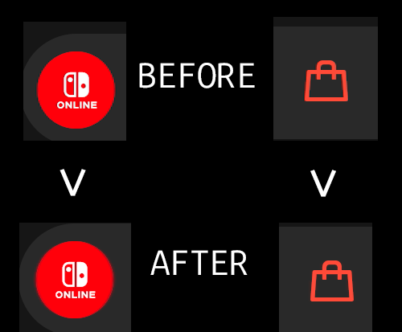
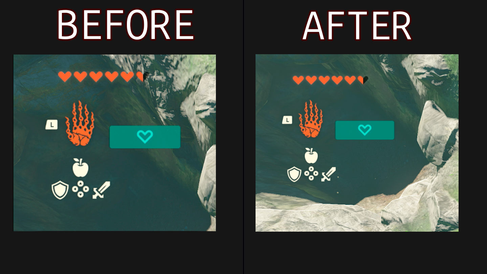
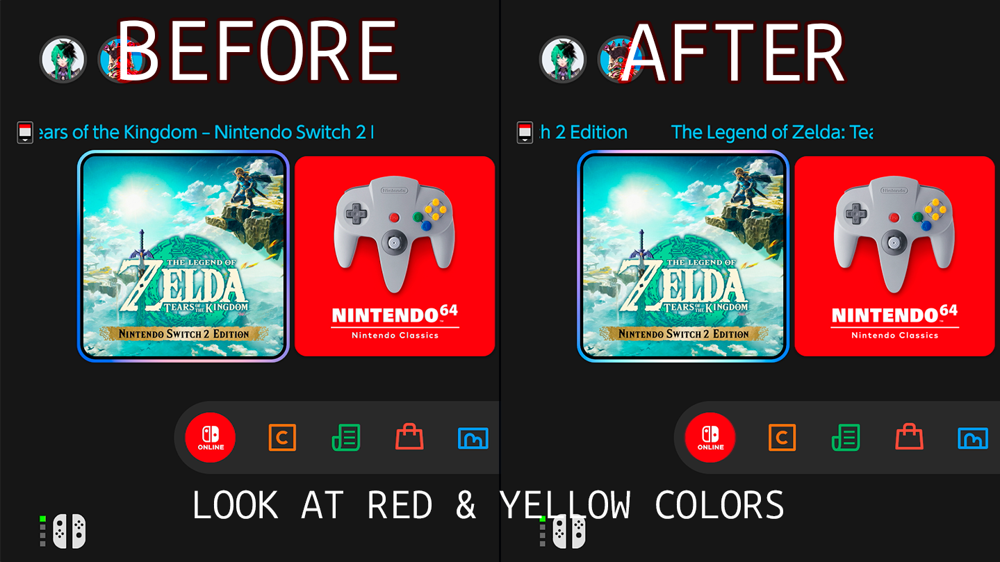

# YUVision

YUVision is a low-latency Windows viewer for USB HDMI capture cards. It is built for native
1920x1080 60 fps YUY2 capture from the ezcap331 / ezcap CAM LINK 4K.

The app reconstructs 4:2:2 chroma and converts Rec.709 YUY2 to RGB in a D3D11 shader. It keeps
only the newest frame, so slow rendering drops old frames instead of increasing latency.



### More comparisons





## Features

- Native Media Foundation capture with hidden format conversion disabled
- Original luma-guided, bilinear, bicubic, conservative, and adaptive chroma modes
- Manual chroma offset and Limited / Full range selection
- Native-resolution GPU conversion followed by sharp bicubic window scaling
- Borderless fullscreen, VSync toggle, and tearing when supported
- Low-latency 48 kHz WASAPI audio with app-local volume and mute
- Capture, render, drop, queue, timestamp, format, and audio diagnostics

## Build

Requirements: Windows 10/11 x64, Visual Studio 2022, and a Windows SDK.

```powershell
cmake -S . -B build -A x64
cmake --build build --config Release
```

## Build the MSI installer

The MSI build is intentionally opt-in. Double-click the one-step build script:

```text
build-release.cmd
```

It downloads a pinned, repository-local copy of WiX 4.0.4, builds the release executable with
the static MSVC runtime, verifies that no dynamic MSVC runtime DLLs slipped into the build, and
creates the MSI test bundle. The underlying PowerShell entry point can also be run directly:

```powershell
powershell -ExecutionPolicy Bypass -File .\scripts\windows\build-msi.ps1
```

The bundle is written to `out\msi\YUVision-v<version>-installer`. Run
`Install-YUVision.cmd` when you want a verbose installation log next to the installer. The MSI
itself can also be opened directly. Runtime logs are stored in
`%LOCALAPPDATA%\YUVision\Logs` and can be opened from YUVision's **Open logs** menu item.

Prerequisites for building the installer are Visual Studio 2022 Build Tools with the Windows SDK,
CMake 3.30 or newer, the .NET 10 SDK, and internet access for the first WiX restore.

The executable is `build\Release\YUVision.exe`. Release builds use the static MSVC runtime, so
no separate Visual C++ Redistributable installation is required.

Create the distributable ZIP from the CMake install manifest instead of archiving the EXE by
hand:

```powershell
cpack --config build\CPackConfig.cmake -C Release
```

Standard Windows 10/11 editions include Media Foundation. Windows N editions additionally
require Microsoft's Media Feature Pack.

## Controls

- `F11` or `Alt+Enter`: borderless fullscreen
- `V`: VSync
- `A`: sharp bicubic window scaling
- `1` to `6`: select a chroma reconstruction mode
- `Left` / `Right`: adjust chroma offset (`Shift` uses larger steps)
- `Down` / `Up`: adjust edge threshold (`Shift` uses larger steps)
- `S`: split screen, bilinear on the left and selected mode on the right
- `R`: Limited / Full input range
- `O`: debug overlay
- `+` / `-`, mouse wheel, or media volume keys: adjust YUVision audio volume
- `M`: mute or unmute YUVision audio
- Menu or right click: select capture mode, audio devices, and volume

YUY2 is currently the implemented video path. NV12 and XRGB native modes may be listed by the
device, but remain disabled. The diagnostic log is written to `%TEMP%\YUVision.log`.

Technical details are in [docs/ARCHITECTURE.md](docs/ARCHITECTURE.md) and
[docs/RESEARCH.md](docs/RESEARCH.md).
